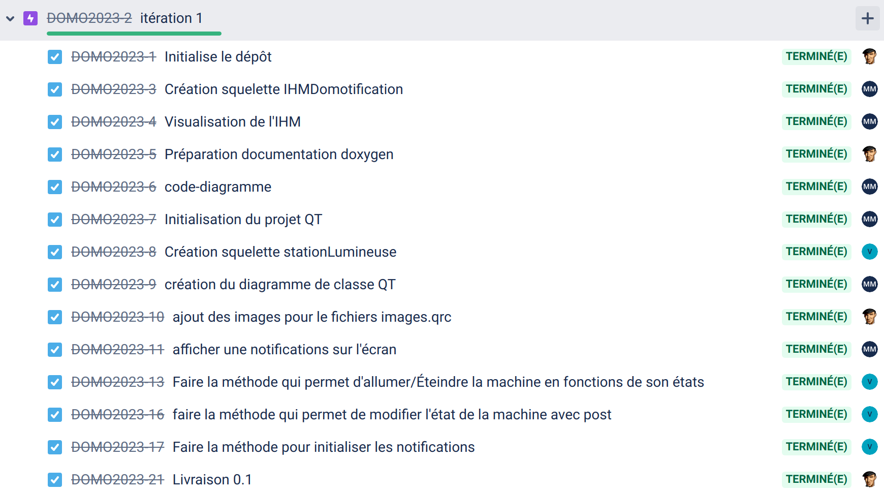

# Le projet domotifications 2023

- [Le projet domotifications 2023](#le-projet-domotifications-2023)
  - [Documentation du code](#documentation-du-code)
  - [Versions](#versions)
    - [0.1](#01)
  - [Auteurs](#auteurs)

---

Le système **domotifications** doit permettre de notifier visuellement des évènements domotiques (quand et quelle poubelle sortir, quand est-ce qu’un colis a été livré dans la boîte aux lettres et quand est-ce qu’une des machines à laver ou sécher le linge a terminé, ...).

La station de notifications lumineuses est composée d’un bandeau circulaire à leds piloté par un ESP32. Celui-ci est découpé en trois groupes distincts pour les notifications :

- en vert : la notification d’une machine terminée (le système peut gérer jusqu’à _n_ machines individuellement),
- en rouge : la présence d’un colis dans la boîte aux lettres,
- en rouge/bleu/vert/gris/jaune : la notification d'une poubelle de tri à sortir.

L’application PC Desktop permet de configurer l’ensemble du système, activer/désactiver un module et afficher/acquitter une notification.

## Documentation du code

https://btssn-lasalle-84.github.io/domotifications-2023/

## Versions

### 0.1

## Auteurs

- Étudiant IR : Alexis VAILLEN (Station ESP32)
- Étudiant IR : Mathieu MOYAERTS (Application Qt)

---
©️ LaSalle Avignon 2023
