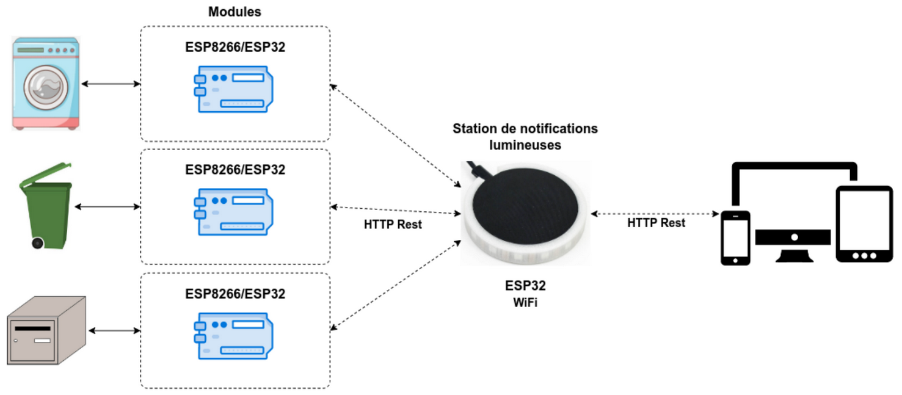

 

 [](https://github.com/btssn-lasalle-84/domotifications-2023/actions/workflows/make-qt.yml) [](https://github.com/btssn-lasalle-84/domotifications-2023/actions/workflows/build-platformio.yml) [](https://github.com/btssn-lasalle-84/domotifications-2023/actions/workflows/pages/pages-build-deployment)

# Le projet domotifications 2023

- [Le projet domotifications 2023](#le-projet-domotifications-2023)
  - [Fonctionnalités](#fonctionnalit%C3%A9s)
  - [Documentation du code](#documentation-du-code)
  - [Présentations](#pr%C3%A9sentations)
  - [Vidéo](#vid%C3%A9o)
  - [Diagramme de classes](#diagramme-de-classes)
  - [Protocole](#protocole)
  - [Screenshots](#screenshots)
  - [Historique des versions](#historique-des-versions)
    - [1.0](#10)
    - [0.2](#02)
    - [0.1](#01)
  - [Auteurs](#auteurs)

---

Le système **domotifications** doit permettre de notifier visuellement des évènements domotiques (quand et quelle poubelle sortir, quand est-ce qu’un colis a été livré dans la boîte aux lettres et quand est-ce qu’une des machines à laver ou sécher le linge a terminé, ...).


La [station de notifications lumineuses](station-notifications-lumineuses/README.md) est composée d’un bandeau circulaire à leds piloté par un ESP32. Celui-ci est découpé en trois groupes distincts pour les notifications :

- en vert : la notification d’une machine terminée (le système peut gérer jusqu’à _n_ machines individuellement),
- en rouge : la présence d’un colis dans la boîte aux lettres,
- en rouge/bleu/vert/gris/jaune : la notification d'une poubelle de tri à sortir.



## Fonctionnalités

La [station de notifications lumineuses](station-notifications-lumineuses/README.md) assure la visualisation des notifications lumineuses.


| Fonctionnalité   | OUI | NON |
| ------------------------- |:-----:|:-----:|
| Afficher une notification | X |  |
| Acquitter une notification | X |  |
| Traiter les requêtes GET et POST | X |  |
| Dialoguer avec l’IHM | X |  |
| Dialoguer les modules | X |  |
| Activer/Désactiver un module | X |  |

L’application PC Desktop permet de configurer l’ensemble du système, activer/désactiver un module et afficher/acquitter une notification.


| Fonctionnalité   | OUI | NON |
| ------------------------- |:-----:|:-----:|
| Configurer le système | X |  |
| Acquitter une notification | X |  |
| Activer/Désactiver un module | X |  |
| Afficher une notification | X |  |
| Dialoguer avec la station lumineuse | X |  |

## Documentation du code

https://btssn-lasalle-84.github.io/domotifications-2023/

## Présentations

Diaporamas étudiants IR :

- Alexis VAILLEN (ESP32) : [Revue finale - VAILLEN.pptx](./diaporamas/Revue%20finale%20-%20VAILLEN.pptx)
- Mathieu MOYAERTS (Application Qt) : [Revue finale - MOYAERTS.pptx](./diaporamas/Revue%20finale%20-%20MOYAERTS.pptx)


## Vidéo

https://www.youtube.com/@projets-btssn-lasalle84

## Diagramme de classes

- Qt :


- Station (ESP32) :


## Protocole

- [Protocole HTTP Domotifications.pdf](docs/Protocole%20HTTP%20Domotifications.pdf)


Exemple :

```sh
$ curl -X GET "http://station-lumineuse.local/poubelle?id=0&etat=1"
{"poubelle": "ok"}

// Vérification
$ curl http://station-lumineuse.local/notifications
{"boite":false,"machines":[true,false,false,false,false,false],"poubelle":[ true,false,false,false,false]}
```

## Screenshots


## Historique des versions


### 1.0


### 0.2


### 0.1


## Auteurs

- Étudiant IR : Alexis VAILLEN ([Station ESP32](station-notifications-lumineuses/README.md))
- Étudiant IR : Mathieu MOYAERTS (Application Qt)

---
©️ LaSalle Avignon 2023
